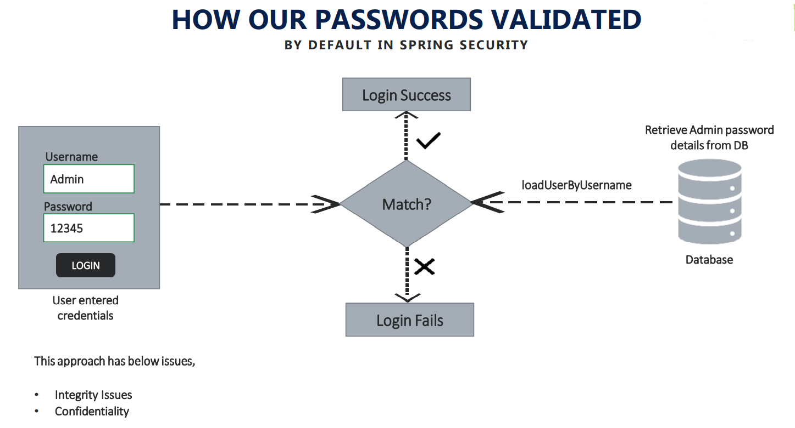
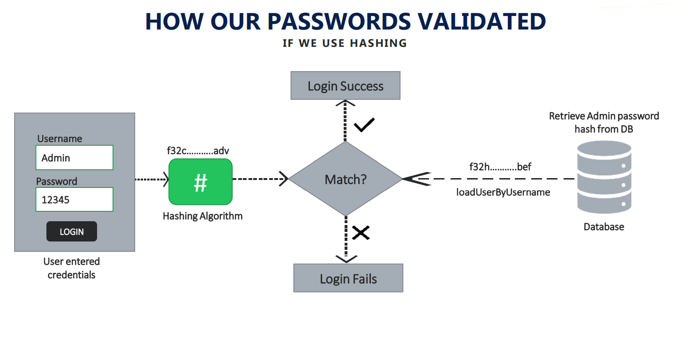
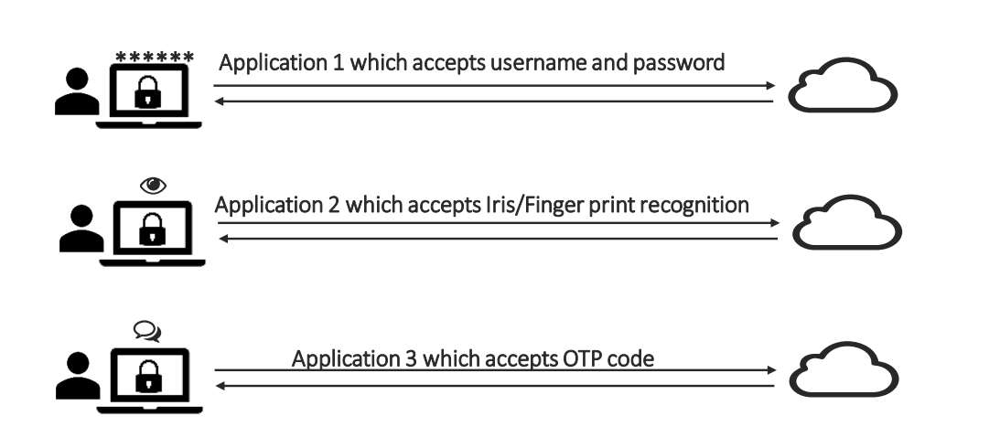
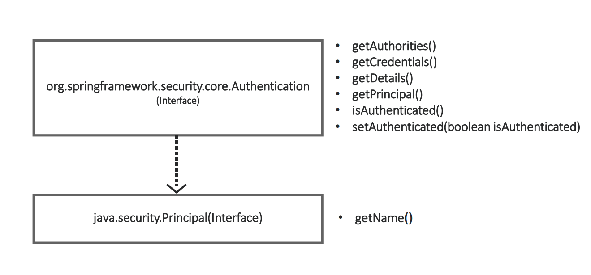
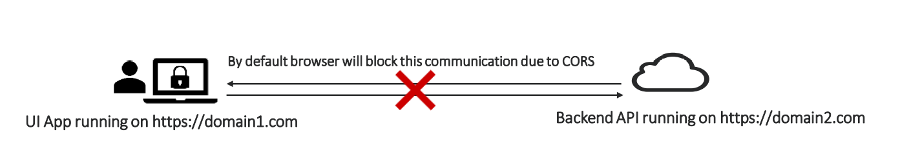
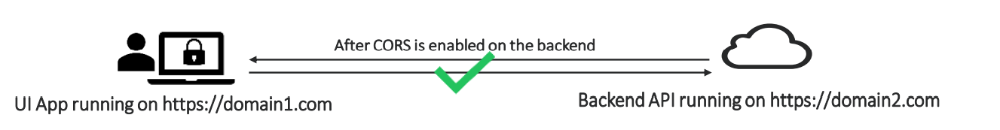
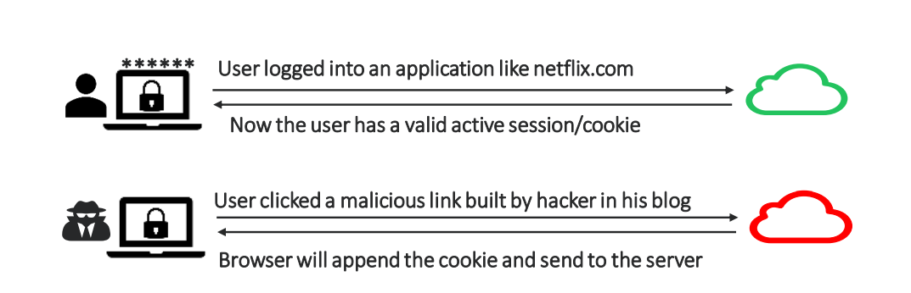
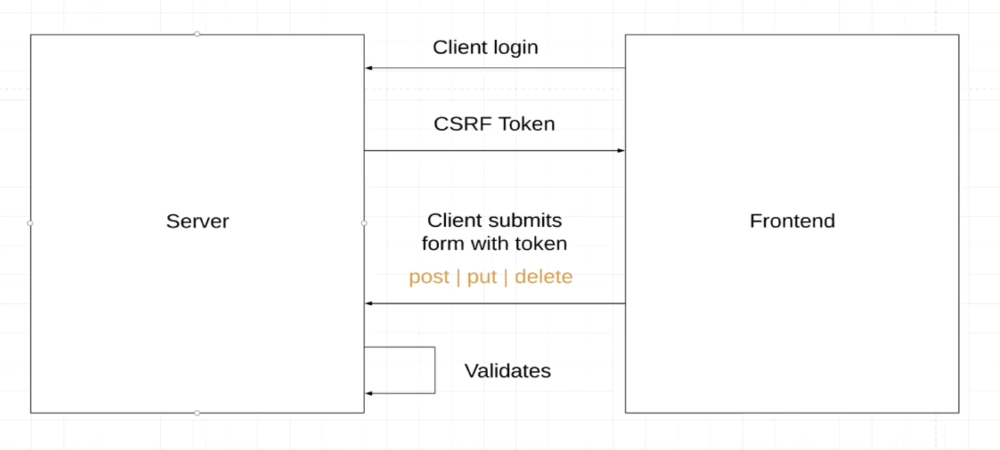

> **What is security?**

Security is for protecting your data and business logic inside your web application.

Security is very important similar to scalability, performance and availability. No client will specifically ask that
need security.

> **What is security?**

Security is for protecting your data and business logic inside your web application.

> **Enable Spring Security**

1) Add Dependency

```
<dependencies>
    <dependency>
    <groupId>org.springframework.boot</groupId>
    <artifactId>spring-boot-starter-security</artifactId>
    </dependency>
</dependencies>
```

2) Change username and password:

For demo, change user and password

In properties file:

- `spring.security.user.name = user`
- `spring.security.user.password = 123456`
- `spring.security.user.roles = ADMIN`

After login for first time , we can refresh and get the same response , because backend is not asking credential again
and again.

That means it is only asking credentials from user first time. It set sessionID to Cookie.

> **Postman**

If you want to use postman, first must set username and password.

Go to Authorization tab and chose Basic auth from dropdown.

Spring security set JSeesonID to header after that not required to set username and password for each request, If delete
JSessionId from cookie (in postman) will see that get 401(unauthorized) error.


> **Spring Security Authentication Process**

How Spring security framework works internally, once it receives any request from front end, third part api consumer,
etc.


Authentication Filter will be intercepting the request, it will try to convert authentication details that receiving
from the user like username and password into an authentication object.

This authentication object is a base where all the validation of user,credentials will be validated for all steps.

Once that authentication object is build, the request will be passed to the authentication manager.

Authentication manager is the place where it will identify what is a correspondent authentication provider that my
request has to go .

we have many process where we can validate user credentials, like database, ldap, OAuth, etc,

Once authentication provider receives the request, this is a place where all your business logic will be implemented.
(the logic related to your security like how do I validate username and password)

Authentication provider will use two interfaces:

- User Details Service
- Password Encoder

The user details services is the interface which holds user schema, like how user details should look like.

The password encoder is the interface which will tell how my password has to be encrypted, encoded or decrypted.

Once authentication provider using user detail services and password encoder validator with the input are valid or not ,
the flow will be given back to Authentication manager and authentication filter.

If user is valid, the authentication filter will pass that the authentication object to security context .

## Components:

1) **Authentication Filter** : It's a Filter in the FilterChain which detects an authentication attempt and forwards it
   to the AuthenticationManager


3) **Authentication** : This component specifies the type of authentication to be conducted. Its is an interface. Its
   implementation specifies the type of Authentication. For example, `UsernamePasswordAuthenticationToken` is an
   implementation of the `Authentication` interface which specifies that the user wants to authenticate using a username
   and password. Other examples include `OpenIDAuthenticationToken` , `RememberMeAuthenticationToken` .


4) **Authentication Manager** : The main job of this component is to delegate the authenticate() call to the correct
   AuthenticationProvider. An application can have multiple AuthenticationProvider s, few of which are
   `DaoAuthenticationProvider`, `LdapAuthenticationProvider`, `OpenIDAuthenticationProvider`, etc. The Authentication
   Manager decides which Authentication Provider to delegate the call to by calling the supports() method on every
   available AuthenticationProvider. If the supports() method returns true then that AuthenticationProvider supports the
   Authentication type and is used to perform authentication.

4. **Authentication Provider** : It is an interface whose implementation processes a certain type of authentication . An
   AuthenticaionProvider has an authenticate method which takes in the Authentication type and performs authentication
   on it. On successful authentication, the AuthenticationProvider returns back an Authentication object of the same
   type that was taken as input with the authenticated property set to true. If authentication fails, then it throws an
   Authentication Exception. Following figure shows a generalized AuthenticationProvider.


5. **UserDetailsService**: This is a service which is responsible for fetching the details of the user from a
   “datasource”, most likely a database using the loadUserByUsername(String username) methods which takes in the
   username as a parameter. It then returns a UserDetails object populated with the user data fetched from the
   datasource ( database )
    - The three main fields of an UserDetails object are username, password and the roles/authorities.

----
> **Changing the default security configurations**

### Steps:

1. Create Configuration class and extend `WebSecurityConfigurerAdapter` class.

```java

@Configuration
public class ProjectSecurityConfig extends WebSecurityConfigurerAdapter {
   ...
}
```

2. Override configure method

```java 
@Override
    protected void configure(HttpSecurity http) throws Exception {
    }
```

3. Add custom configuration

- Default configurations which will secure all the requests

 ```java
http.authorizeRequests()
        .anyRequest().authenticated()
        .and()
        .formLogin().and()
        .httpBasic();
``` 

- Custom configurations as per our requirement

```java
http.authorizeRequests()
        .antMatchers("/myAccount").authenticated()
        .antMatchers("/myBalance").authenticated()
        .antMatchers("/myLoans").authenticated()
        .antMatchers("/myCards").authenticated()
        .antMatchers("/notices").permitAll()
        .antMatchers("/contact").permitAll()
        .and().formLogin()
        .and().httpBasic();
```

- Configuration to deny all the requests

```java
http.authorizeRequests()
        .anyRequest().denyAll()
        .and().formLogin()
        .and().httpBasic();
```

- Configuration to permit all the requests

```java
http.authorizeRequests()
        .anyRequest().permitAll()
        .and().formLogin()
        .and().httpBasic();
```

---
> **Defining and Managing Users**

When we want to customize our userDetails, users, useDetailsService and passwordEncoder,along with authentication
providers. we have to override another method provided by spring security framework .

```java
@Override
protected void configure(AuthenticationManagerBuilder auth)throws Exception{
        ...
        }
```

User detail service and password encoder are the important interfaces that helps in maintaining the user details and
validating them.

That means if someone provides some credentials, these two user detail services and password encoder have the
responsibility of validating whether the username and password entered by user is correct or not.

#### The problem with the current application that we have developed in the previous section is it has only a single user that we configured in the application properties

If you want to customize your user detail service have to override this method.

### use in memory authentication

```java
@Override
protected void configure(AuthenticationManagerBuilder auth)throws Exception{
        // That means all these users that we want to maintain will be stored inside memory of spring container
        auth.inMemoryAuthentication()
        .withUser("admin").password("123456").authorities("admin")
        .and()
        .withUser("user").password("123456").authorities("read")
        .and()
        .passwordEncoder(NoOpPasswordEncoder.getInstance());
        //Whenever we are trying to customize the user details by default, definitely we should pass the password encoder  
        //if you are not passing the password encoder, spring security will throw an error
        }
```

### another way

```java
@Override
protected void configure(AuthenticationManagerBuilder auth)throws Exception{
        InMemoryUserDetailsManager userDetailsManager=new InMemoryUserDetailsManager();
        UserDetails user1=User.withUsername("admin").password("123456").authorities("admin").build();
        UserDetails user2=User.withUsername("user").password("123456").authorities("read").build();
        userDetailsManager.createUser(user1);
        userDetailsManager.createUser(user2);
        auth.userDetailsService(userDetailsManager).passwordEncoder(NoOpPasswordEncoder.getInstance());
        }
```

### another way

```java
@Override
@Bean
protected UserDetailsService userDetailsService(){
        UserDetails alirezaUser=User.builder()
        .username("alireza")
        .password(passwordEncoder().encode("123")).roles("STUDENT").build();
        return new InMemoryUserDetailsManager(alirezaUser);
        }

@Bean
public PasswordEncoder passwordEncoder(){
        return NoOpPasswordEncoder.getInstance();
        }
```

#### If remove `passwordEncoder(NoOpPasswordEncoder.getInstance())` Spring security throw en exception .

That means spring security framework always expect password encoder to be mapped user details service

#### We have to create `@bean` a type of PasswordEncoder for demo, returning `NoOpPasswordEncoder.getInstance()`


> **UserDetails interface**

This interface describes the user.

`org.springframework.security.core.userdetails.UserDetails`: A representation of user information including but not
limited to username, password, account status, and the roles associated to the user etc. If you want to provide your
implementation for user information to the security context, you need to implement this interface. User Details is a
contract or schema, a blueprint maintained by the spring security framework to represent an actual user who is trying to
access our application.

Whenever we are trying to create our own user schema definition, we have to implement this interface.

If you want to implement userDetail interface make sure properties must be like User class

```java
public class User implements UserDetails, CredentialsContainer {
}
```

If we are good with the default schema provided by the userDetails interface inside spring security, you are free to use
the User class implementation, otherwise, if you want to have your own blueprint or schema for your application, then
must implement UserDetail interface.

> **UserDetailsService interface**

This interface defines a method that finds the user by username.

`org.springframework.security.core.userdetails.UserDetailsService`: An interface that let you provide UserDetails to the
security context. Providing a custom implementation for `loadUserByUsername(String userName)`

The UserDetailsService interface is used to retrieve user-related data. It has one method named `loadUserByUsername()`
which can be overridden to customize the process of finding the user.

It loads User by username And the return type of our UserDetails interface.

In order to provide our own user service, we will need to implement the UserDetailsService interface.

It sends only username because in DBS can check the query logs and see what queries have been sent . Pulling the user
details based upon username,either from a database or from memory location, or LDAP server

So once we had those user details available, spring security can be saying by having the password that is received from
the database and what it is receiving from UI.So by comparing using password encoder,it will decide whether the
logged-in user is a valid or not.

Can see the `DaoAuthenticationProvider` called this interface.
> **UserDetailsManger interface**

This interface extends UserDetailsService interface. It is also responsible for user create, updates, or delete
operations.

when your application has to handle creating, updating, deleting the user details, then use a detail service interface
will not be enough then we should implement user detail manager interface, which internally extends user details service
as well.

> **InMemoryDetailsManager , JdbcUserDetailsManager , LdapUserDetailsManager**

We can implement these interfaces and customizing those, but to reduce or works spring security framework provided three
implementation of user details.

```java
<dependency>
<groupId>org.springframework.boot</groupId>
<artifactId>spring-boot-starter-jdbc</artifactId>
</dependency>
```

```java
@Bean
protected UserDetailsService userDetailsService(DataSource dataSource){
        return new JdbcUserDetailsManager(dataSource);
        }
```

```sql
create table users
(
    id       int identity (1,1) not null primary key,
    username varchar(255) not null unique,
    password varchar(255) not null,
    enabled  int          not null,
);

create table authorities
(
    id        int identity (1,1) not null primary key,
    username  varchar(255) not null,
    authority varchar(255) not null,
    unique (username, authority)
);

insert into users (username, password, enabled)
values ('alireza', '123', 1);
insert into authorities (username, authority)
values ('alireza', 'read');
```

```spel
spring.datasource.driverClassName = com.microsoft.sqlserver.jdbc.SQLServerDriver
spring.datasource.url = jdbc:sqlserver://localhost:1433;databaseName=myApp
spring.datasource.username = sa
spring.datasource.password = Passw0rd
spring.jpa.show-sql = true
spring.jpa.properties.hibernate.format_sql = true
spring.jpa.hibernate.ddl-auto = update
```

### Creating our own custom implementation of UserDetailsService

1. Create table

```sql
create table customer
(
    id    int identity (1,1) not null primary key,
    email varchar(255) not null unique,
    pwd   varchar(255) not null,
    role  varchar(255) not null
);
insert into customer (email, pwd, role)
values ('ali@gmail.com', '123', 'admin');
```

2. Create Customer entity

```java

@Entity
public class Customer {
    @Id
    @GeneratedValue(strategy = GenerationType.AUTO)
    private int id;
    private String email;
    private String pwd;
    private String role;
    // Getter and Setter
}
```

3. Create Customer repository

```java

@Repository
public interface CustomerRepository extends CrudRepository<Customer, Long> {
    Optional<Customer> findByEmail(String email);
}
```

4. Create SecurityCustomer

```java
public class SecurityCustomer implements UserDetails {

    private final Customer customer;

    public SecurityCustomer(Customer customer) {
        this.customer = customer;
    }

    @Override
    public Collection<? extends GrantedAuthority> getAuthorities() {
        List<GrantedAuthority> authorities = new ArrayList<>();
        authorities.add(new SimpleGrantedAuthority(customer.getRole()));
        return authorities;
    }

    @Override
    public String getPassword() {
        return customer.getPwd();
    }

    @Override
    public String getUsername() {
        return customer.getEmail();
    }

    @Override
    public boolean isAccountNonExpired() {
        return true;
    }

    @Override
    public boolean isAccountNonLocked() {
        return true;
    }

    @Override
    public boolean isCredentialsNonExpired() {
        return true;
    }

    @Override
    public boolean isEnabled() {
        return true;
    }
}
```

5. Create CustomUserDetailsService

```java
public class CustomUserDetailsService implements UserDetailsService {

    @Autowired
    private CustomerRepository customerRepository;

    @Override
    public UserDetails loadUserByUsername(String username) throws UsernameNotFoundException {
        Optional<Customer> customer = customerRepository.findByEmail(username);
        if (!customer.isPresent()) {
            throw new UsernameNotFoundException("User Details not found for the user:" + username);
        }
        return new SecurityCustomer(customer.get());
    }
}
```

```java

@SpringBootApplication
@ComponentScan("com.example")
@EnableJpaRepositories("com.example.repository")
@EntityScan("com.example.model")
public class SpringSecurityDemoApplication {
    public static void main(String[] args) {
        SpringApplication.run(SpringSecurityDemoApplication.class, args);
    }
}
```

---
> **Password Management With Password Encoder**



When you insert password in plain text (without any encryption, encoding , hashing), everyone can access to table can
see all the password.

The other issue, you are sending passwords in plain text on the network.

> **ENCODING**

- Encoding is defined as the process of converting data from one form to another form and has nothing to do with
  cryptography.It guarantees none of the 3 cryptographic properties of confidentiality, integrity, and authenticity
  because it involves no secret and in completely reversible.


- Encoding can be used for reducing the size of audio and video files.Each audio and video file format has a
  corresponding coder-decoder(codec) program that is user to code it into the appropriate format and then decodes for
  playback.


- It can't be used for security data, various publicly available algorithms are used for encoding.

<center>Example: ASCII, BASE64, UNICODE</center>

> **ENCRYPTION**

- Encryption is defined as the process of transforming data in such a way that guarantees confidentiality.to achieve
  that, encryption requires the use of a secret which, in cryptographic terms, we call a "key".


- Encryption is divided into two categories, where the major difference is the number of keys needed.

    - symmetric
    - asymmetric

- In symmetric encryption algorithms, a single secret (key) is used to both encrypt and decrypt data. Only those who are
  authorized to access the data should have the single shared key in their possession.

<center>Example:File system encryption, database encryption</center>

- On the other hand, in asymmetric encryption algorithms, there are two keys in use: one public and one private.As their
  names suggest, the private key must be kept secret, whereas the public can be known to everyone.When applying
  encryption, the public key is used, whereas decryption requires the private key. Anyone should be able to send us
  encrypted data, but only we should be able to decrypt and read it!

 <center>Example: TLS, VPN, SSH</center>

Encryption not suitable for password management because everyone accesses to public key (symmetric) or private key (
asymmetric) can see the password.

> **HASHING**

• In hashing, data is converted to the hash using some hashing function, which can be any number generated from string
or text.Various hashing algorithms are MD5, SHA256. Data once hashed non-reversible.

• One cannot determine the original data given only the output of a hashing algorithms.

• Given some arbitrary data along with the output of a hashing algorithm, one can verify whether this data matches the
original input data without needing to see the original data

• You may have heard of hashing used in the context of passwords. Among many uses of hashing algorithms, this is one of
the most well-known. When you sign up on a web app using a password, rather than storing your actual password, which
would not only be a violation of your privacy but also a big risk for the web app owner, the web app hashes the password
and stores only the hash.

• Then, the next time you log in, the web app again hashes your password and compares this hash with the hash stored
earlier. If the hashes match, the web app can be confident that you know your password even though the web app doesn’t
have your actual password in storage.

<center>Example: Password management, verify the integrity of the downloaded file</center>



> **Definition Of The Password Encoder**

```java
public interface PasswordEncoder {

    String encode(CharSequence rawPassword);

    boolean matches(CharSequence rawPassword, String encodedPassword);

    //That means you will be doing that encoding, encryption or hashing two times.
    default boolean upgradeEncoding(String encodedPassword) {
        return false;
    }
}
```

> **Different Implementations of PasswordEncoders provided by Spring Security**

- NoOpPasswordEncoder
- StandardPasswordEncoder
- Pbkdf2PasswordEncoder
- BCryptPasswordEncoder
- SCryptPasswordEncoder

1- NoOpPasswordEncoder

```java
   @Bean
public PasswordEncoder passwordEncoder(){
        return NoOpPasswordEncoder.getInstance();
        }
```

2- StandardPasswordEncoder

```java
  @Bean
public PasswordEncoder passwordEncoder(){
        return new StandardPasswordEncoder();
        }
```

This use SHA-256 and can add salt to it;.

> **Pbkdf2PasswordEncoder**

- Password-Based Key Derivation Function 2 (PBKDF2) is a pretty easy slow-hashing function that performs an HMAC
  (Hashed Message Authentication Code) as many times as specified by an iterations' argument.

- The three parameters received by the last call are the value of a key used for the encoding process, the number of
  iterations used to encode the password, and the size of the hash. The second and third parameters can influence the
  strength of the result.


- You can choose more or fewer iterations as well as the length of the result. The longer the hash, the more powerful
  the password is.

```java
        PasswordEncoder p=newPbkdf2PasswordEncoder();
        PasswordEncoder p=newPbkdf2PasswordEncoder("secret");
        PasswordEncoder p=newPbkdf2PasswordEncoder("secret",185000,256);
```

> **Bcrypt & Scrypt PasswordEncoder**

- BCryptPasswordEncoder uses a BCrypt strong hashing function to encode the password. You could instantiate the
  BCryptPasswordEncoder by calling the no-arguments constructor. But you also have the option to specify a strength
  coefficient representing the log rounds used in the encoding process. Moreover, you can as well alter the SecureRandom
  instance used for encoding.

```java
PasswordEncoder p=newBCryptPasswordEncoder();
        PasswordEncoder p=newBCryptPasswordEncoder(4);
        SecureRandom s=SecureRandom.getInstanceStrong();
        PasswordEncoder p=newBCryptPasswordEncoder(4,s);
```

- CryptPasswordEncoder uses a SCrypt hashing function to encode the password. For the SCryptPasswordEncoder, you have
  two options create instances:

```java
PasswordEncoder p=n ewSCryptPasswordEncoder();
        PasswordEncoder p=newSCryptPasswordEncoder(16384,8,1,32,64);
```

----
> **Authentication Provider**

If we don't want to use the default way of authentication? Like we don't want to use userDetailService,
UserDetailManager or PasswordEncoder. I just want to write my own logic based upon my application requirement.

In such scenarios, we have an optional of customizing the Authentication provider.

In the spring security architecture, as soon as a request has been coming from the user, filter will intercept that
request and will convert it into authentication object and that will be given to the authentication manager
implementation. authentication manager will given to the authentication provider for validation.



The AuthenticationProvider in Spring Security takes care of the authentication logic. The default implementation of the
AuthenticationProvider delegates the responsibility of finding the user in the system to a UserDetailsService and
PasswordEncoder for password validation. But if we have a custom authentication requirement that is not fulfilled by
Spring Security framework then we can build our own authentication logic by implementing the AuthenticationProvider
interface.

I want to my own authentication logic inside my authentication provider by implementing it.

Authentication manager will call authentication provider to perform the authentication of the user.

```java
public interface AuthenticationProvider {
    Authentication authenticate(Authentication authentication)
            throws AuthenticationException;

    boolean supports(Class<?> authentication);
}
```

- The authenticate() method receives an Authentication object as a parameter and returns an Authentication object as
  well. We implement the authenticate() method to define the authentication logic.

Authentication manager call authenticate method inside this provider

- The second method in the AuthenticationProvider interface is supports(Class<?> authentication). You’ll implement this
  method to return true if the current AuthenticationProvider supports the type provided as the Authentication object.

#### `ProviderManager` is implementation of AuthenticationManager.

#### `DaoAuthenticationProvider` is implementation of AuthenticationProviders interface

> **Authentication & Principal**



```java

@Component
public class CustomUsernamePwdAuthenticationProvider implements AuthenticationProvider {

    @Autowired
    private CustomerRepository customerRepository;

    @Autowired
    private PasswordEncoder passwordEncoder;

    @Override
    public Authentication authenticate(Authentication authentication) {
        String username = authentication.getName();
        String password = authentication.getCredentials().toString();
        Optional<Customer> customer = customerRepository.findByEmail(username);
        if (customer.isPresent()) {
            if (passwordEncoder.matches(password, customer.get().getPwd())) {
                List<GrantedAuthority> authorities = new ArrayList<>();
                authorities.add(new SimpleGrantedAuthority(customer.get().getRole()));
                return new UsernamePasswordAuthenticationToken(username, password, authorities);
            } else {
                throw new BadCredentialsException("Invalid Password");
            }
        } else {
            throw new UsernameNotFoundException("User not exists");
        }
    }

    @Override
    public boolean supports(Class<?> authentication) {
        return authentication.equals(UsernamePasswordAuthenticationToken.class);
    }

}
```

---
> **CROSS-ORIGIN RESOURCE SHARING (CORS)**

1. CORS is protocol that enables scripts running on a browser client to interact with resources from a different origin.

2. For example, if a UI app wishes to make an API call running on a different domain, it would be blocked from doing so
   by default due to CORS.So CORS is not a security issue/attack but default protection provided by browsers to stop
   sharing the data/communication between different origins.

3. "Other origins" means the URL being accessed differs from the location that javaScript is running from,by having:

    - a different scheme(HTTP or HTTPS)
    - a different domain
    - a different port



4. But what if there is a legitimate scenario where cross-origin access is desirable or even necessary. For example,
   where the UI and backend are hosted on two different ports.


5. When a server has been configured correctly to allow cross-origin resource sharing, some special headers will be
   included. Their presence can be used to determine that a request supports CORS. Web browsers can use these headers to
   determine whether a request should continue or fail

6. First the browser sends a pre-flight request to the backend server to determine whether it supports CORS or not. The
   server can then respond to the pre-flight request with a collection of headers:

- Access-Control-Allow-Origin: Defines which origins may have access to the resource. A ‘*' represents any origin


- Access-Control-Allow-Methods: Indicates the allowed HTTP methods for cross-origin requests


- Access-Control-Allow-Headers: Indicates the allowed request headers for cross-origin requests


- Access-Control-Allow-Credentials : Indicates whether or not the response to the request can be exposed when the
  credentials flag is true.


- Access-Control-Max-Age: Defines the expiration time of the result of the cached preflight request



- You can disable CORS for test environment

```java
    http
        .cors().disable()
```

- Configuration

```java
    @Bean
    CorsConfigurationSource corsConfigurationSource(){
            CorsConfiguration config=new CorsConfiguration();
            config.setAllowedOrigins(Collections.singletonList("http://localhost:4200"));
            config.setAllowedMethods(Collections.singletonList("*"));
            config.setAllowCredentials(true);
            config.setAllowedHeaders(Collections.singletonList("*"));
            config.setMaxAge(3600L);
            UrlBasedCorsConfigurationSource source=new UrlBasedCorsConfigurationSource();
            source.registerCorsConfiguration("/**",config);
            return source;
            }
```

or

```java
   http.cors().configurationSource(new CorsConfigurationSource(){
@Override
public CorsConfiguration getCorsConfiguration(HttpServletRequest request){
        CorsConfiguration config=new CorsConfiguration();
        config.setAllowedOrigins(Collections.singletonList("http://localhost:4200"));
        config.setAllowedMethods(Collections.singletonList("*"));
        config.setAllowCredentials(true);
        config.setAllowedHeaders(Collections.singletonList("*"));
        config.setMaxAge(3600L);
        return config;
        }
        }) 
```

> **CROSS-SITE REQUEST FORGERY (CSRF)**

1. typical Cross-Site Request Forgery (CSRF or XSRF) attack aims to perform an operation in a web application on behalf
   of a user without their explicit consent. In general, it doesn't directly steal the user's identity, but it exploits
   the user to carry out an action without their will.


2. Consider a website netflix.com and the attacker’s website test.com. Also assume that the victim is logged in and his
   session is being maintained by cookies. The attacker will:

    - Place HTML codes on his website test.com that will imitate a legal request to netflix.com (for example, a form
      with method as post and a hidden input field that contains the new password).

    - Make sure that the form is submitted by either using “autosubmit” or luring the victim to click on a submit button



- When the victim visits test.com and that form is submitted, the victim’s browser makes a request to netflix.com for a
  password change. Also the browser appends the cookies with the request. The server treats it as a genuine request and
  resets the victim’s password to the attacker’s supplied value. This way the victim’s account gets taken over by the
  attacker


- There are many proposed ways to implement CSRF protection on server side, among which the use of CSRF tokens is most
  popular. A CSRF token is a string that is tied to a user’s session but is not submitted automatically. A website
  proceeds only when it receives a valid CSRF token along with the cookies, since there is no way for an attacker to
  know a user specific token, the attacker can not perform actions on user’s behalf.

#### Disable csrf:

- You can disable CSRF for test environment

```java
    http
        .csrf().disable()
```

```java
.csrf()
        .csrfTokenRepository(CookieCsrfTokenRepository
        .withHttpOnlyFalse()).
```

```java
.csrf()
        .ignoringAntMatchers("/contact")
        .csrfTokenRepository(CookieCsrfTokenRepository
        .withHttpOnlyFalse()).
```

If you want to test with postman

1- first enable interceptor in postman

2- get value from cookie tab (`XSRF_TOKEN`)

3- Add value to Header tab `X-XSRF-token`.



## When to use CSRF protection

Our recommendation is to use CSRF protection for any request that could be processed by a browser by normal users.If you
are only creating a service that is used by non-browser clients, you will likely want to disable CSRF protection.
