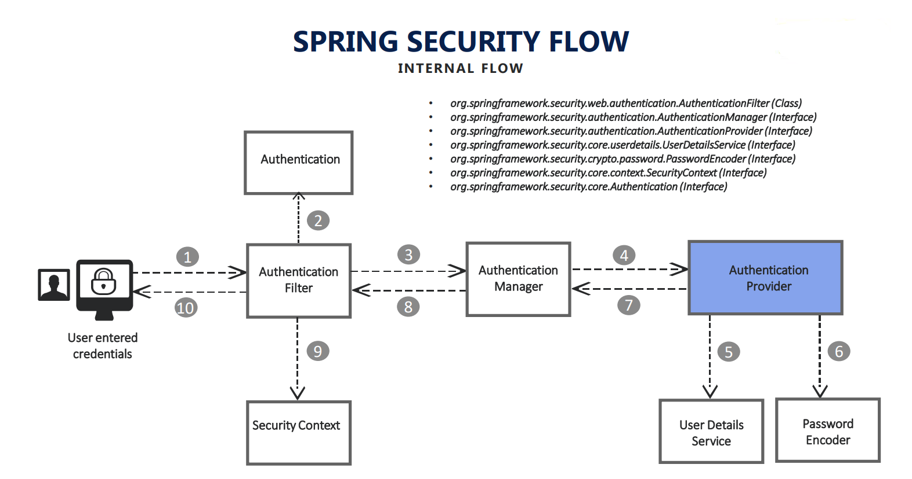
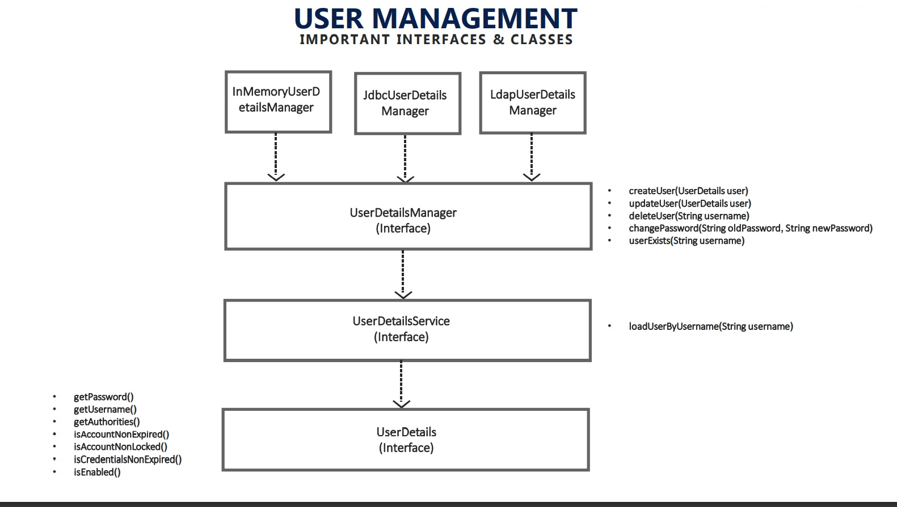

> **What is security?**

Security is for protecting your data and business logic inside your web application.

Security is very important similar to scalability, performance and availability. No client will specifically ask that
need security.

> **What is security?**

Security is for protecting your data and business logic inside your web application.

> **Enable Spring Security**

1) Add Dependency

```
<dependencies>
    <dependency>
    <groupId>org.springframework.boot</groupId>
    <artifactId>spring-boot-starter-security</artifactId>
    </dependency>
</dependencies>
```

2) Change username and password:

For demo, change user and password

In properties file:

- `spring.security.user.name = user`
- `spring.security.user.password = 123456`
- `spring.security.user.roles = ADMIN`

After login for first time , we can refresh and get the same response , because backend is not asking credential again
and again.

That means it is only asking credentials from user first time. It set sessionID to Cookie.

> **Postman**

If you want to use postman, first must set username and password.

Go to Authorization tab and chose Basic auth from dropdown.

Spring security set JSeesonID to header after that not required to set username and password for each request, If delete
JSessionId from cookie (in postman) will see that get 401(unauthorized) error.


> **Spring Security Authentication Process**

How Spring security framework works internally, once it receives any request from front end, third part api consumer,
etc.



Authentication Filter will be intercepting the request, it will try to convert authentication details that receiving
from the user like username and password into an authentication object.

This authentication object is a base where all the validation of user,credentials will be validated for all steps.

Once that authentication object is build, the request will be passed to the authentication manager.

Authentication manager is the place where it will identify what is a correspondent authentication provider that my
request has to go .

we have many process where we can validate user credentials, like database, ldap, OAuth, etc,

Once authentication provider receives the request, this is a place where all your business logic will be implemented.
(the logic related to your security like how do I validate username and password)

Authentication provider will use two interfaces:

- User Details Service
- Password Encoder

The user details services is the interface which holds user schema, like how user details should look like.

The password encoder is the interface which will tell how my password has to be encrypted, encoded or decrypted.

Once authentication provider using user detail services and password encoder validator with the input are valid or not ,
the flow will be given back to Authentication manager and authentication filter.

If user is valid, the authentication filter will pass that the authentication object to security context .

## Components:

1) **Authentication Filter** : It's a Filter in the FilterChain which detects an authentication attempt and forwards it
   to the AuthenticationManager


3) **Authentication** : This component specifies the type of authentication to be conducted. Its is an interface. Its
   implementation specifies the type of Authentication. For example, `UsernamePasswordAuthenticationToken` is an
   implementation of the `Authentication` interface which specifies that the user wants to authenticate using a username
   and password. Other examples include `OpenIDAuthenticationToken` , `RememberMeAuthenticationToken` .


4) **Authentication Manager** : The main job of this component is to delegate the authenticate() call to the correct
   AuthenticationProvider. An application can have multiple AuthenticationProvider s, few of which are
   `DaoAuthenticationProvider`, `LdapAuthenticationProvider`, `OpenIDAuthenticationProvider`, etc. The Authentication
   Manager decides which Authentication Provider to delegate the call to by calling the supports() method on every
   available AuthenticationProvider. If the supports() method returns true then that AuthenticationProvider supports the
   Authentication type and is used to perform authentication.

4. **Authentication Provider** : It is an interface whose implementation processes a certain type of authentication . An
   AuthenticaionProvider has an authenticate method which takes in the Authentication type and performs authentication
   on it. On successful authentication, the AuthenticationProvider returns back an Authentication object of the same
   type that was taken as input with the authenticated property set to true. If authentication fails, then it throws an
   Authentication Exception. Following figure shows a generalized AuthenticationProvider.


5. **UserDetailsService**: This is a service which is responsible for fetching the details of the user from a
   “datasource”, most likely a database using the loadUserByUsername(String username) methods which takes in the
   username as a parameter. It then returns a UserDetails object populated with the user data fetched from the
   datasource ( database )
    - The three main fields of an UserDetails object are username, password and the roles/authorities.

----
> **Changing the default security configurations**

### Steps:

1. Create Configuration class and extend `WebSecurityConfigurerAdapter` class.

```java

@Configuration
public class ProjectSecurityConfig extends WebSecurityConfigurerAdapter {
   ...
}
```

2. Override configure method

```java 
@Override
    protected void configure(HttpSecurity http) throws Exception {
    }
```

3. Add custom configuration

- Default configurations which will secure all the requests

 ```java
http.authorizeRequests()
        .anyRequest().authenticated()
        .and()
        .formLogin().and()
        .httpBasic();
``` 

- Custom configurations as per our requirement

```java
http.authorizeRequests()
        .antMatchers("/myAccount").authenticated()
        .antMatchers("/myBalance").authenticated()
        .antMatchers("/myLoans").authenticated()
        .antMatchers("/myCards").authenticated()
        .antMatchers("/notices").permitAll()
        .antMatchers("/contact").permitAll()
        .and().formLogin()
        .and().httpBasic();
```

- Configuration to deny all the requests

```java
http.authorizeRequests()
        .anyRequest().denyAll()
        .and().formLogin()
        .and().httpBasic();
```

- Configuration to permit all the requests

```java
http.authorizeRequests()
        .anyRequest().permitAll()
        .and().formLogin()
        .and().httpBasic();
```

---
> **Defining and Managing Users**

When we want to customize our userDetails, users, useDetailsService and passwordEncoder,along with authentication
providers. we have to override another method provided by spring security framework .

```java
@Override
protected void configure(AuthenticationManagerBuilder auth)throws Exception{
        ...
        }
```

User detail service and password encoder are the important interfaces that helps in maintaining the user details and
validating them.

That means if someone provides some credentials, these two user detail services and password encoder have the
responsibility of validating whether the username and password entered by user is correct or not.

#### The problem with the current application that we have developed in the previous section is it has only a single user that we configured in the application properties

If you want to customize your user detail service have to override this method.

### use in memory authentication

```java
@Override
protected void configure(AuthenticationManagerBuilder auth)throws Exception{
        // That means all these users that we want to maintain will be stored inside memory of spring container
        auth.inMemoryAuthentication()
        .withUser("admin").password("123456").authorities("admin")
        .and()
        .withUser("user").password("123456").authorities("read")
        .and()
        .passwordEncoder(NoOpPasswordEncoder.getInstance());
        //Whenever we are trying to customize the user details by default, definitely we should pass the password encoder  
        //if you are not passing the password encoder, spring security will throw an error
        }
```

### another way

```java
@Override
protected void configure(AuthenticationManagerBuilder auth)throws Exception{
        InMemoryUserDetailsManager userDetailsManager=new InMemoryUserDetailsManager();
        UserDetails user1=User.withUsername("admin").password("123456").authorities("admin").build();
        UserDetails user2=User.withUsername("user").password("123456").authorities("read").build();
        userDetailsManager.createUser(user1);
        userDetailsManager.createUser(user2);
        auth.userDetailsService(userDetailsManager).passwordEncoder(NoOpPasswordEncoder.getInstance());
        }
```

### another way

```java
@Override
@Bean
protected UserDetailsService userDetailsService(){
        UserDetails alirezaUser=User.builder()
        .username("alireza")
        .password(passwordEncoder().encode("123")).roles("STUDENT").build();
        return new InMemoryUserDetailsManager(alirezaUser);
        }

@Bean
public PasswordEncoder passwordEncoder(){
        return NoOpPasswordEncoder.getInstance();
        }
```

#### If remove `passwordEncoder(NoOpPasswordEncoder.getInstance())` Spring security throw en exception .

That means spring security framework always expect password encoder to be mapped user details service

#### We have to create `@bean` a type of PasswordEncoder for demo, returning `NoOpPasswordEncoder.getInstance()`



> **UserDetails interface**

This interface describes the user.

`org.springframework.security.core.userdetails.UserDetails`: A representation of user information including but not
limited to username, password, account status, and the roles associated to the user etc. If you want to provide your
implementation for user information to the security context, you need to implement this interface. User Details is a
contract or schema, a blueprint maintained by the spring security framework to represent an actual user who is trying to
access our application.

Whenever we are trying to create our own user schema definition, we have to implement this interface.

If you want to implement userDetail interface make sure properties must be like User class

```java
public class User implements UserDetails, CredentialsContainer {
}
```

If we are good with the default schema provided by the userDetails interface inside spring security, you are free to use
the User class implementation, otherwise, if you want to have your own blueprint or schema for your application, then
must implement UserDetail interface.

> **UserDetailsService interface**

This interface defines a method that finds the user by username.

`org.springframework.security.core.userdetails.UserDetailsService`: An interface that let you provide UserDetails to the
security context. Providing a custom implementation for `loadUserByUsername(String userName)`

The UserDetailsService interface is used to retrieve user-related data. It has one method named `loadUserByUsername()`
which can be overridden to customize the process of finding the user.

It loads User by username And the return type of our UserDetails interface.

In order to provide our own user service, we will need to implement the UserDetailsService interface.

It sends only username because in DBS can check the query logs and see what queries have been sent . Pulling the user
details based upon username,either from a database or from memory location, or LDAP server

So once we had those user details available, spring security can be saying by having the password that is received from
the database and what it is receiving from UI.So by comparing using password encoder,it will decide whether the
logged-in user is a valid or not.

Can see the `DaoAuthenticationProvider` called this interface.
> **UserDetailsManger interface**

This interface extends UserDetailsService interface. It is also responsible for user create, updates, or delete
operations.

when your application has to handle creating, updating, deleting the user details, then use a detail service interface
will not be enough then we should implement user detail manager interface, which internally extends user details service
as well.

> **InMemoryDetailsManager , JdbcUserDetailsManager , LdapUserDetailsManager**

We can implement these interfaces and customizing those, but to reduce or works spring security framework provided three
implementation of user details.

```java
<dependency>
<groupId>org.springframework.boot</groupId>
<artifactId>spring-boot-starter-jdbc</artifactId>
</dependency>
```

```java
@Bean
protected UserDetailsService userDetailsService(DataSource dataSource){
        return new JdbcUserDetailsManager(dataSource);
        }
```

```sql
create table users
(
    id       int identity (1,1) not null primary key,
    username varchar(255) not null unique,
    password varchar(255) not null,
    enabled  int          not null,
);

create table authorities
(
    id        int identity (1,1) not null primary key,
    username  varchar(255) not null,
    authority varchar(255) not null,
    unique (username, authority)
);

insert into users (username, password, enabled)
values ('alireza', '123', 1);
insert into authorities (username, authority)
values ('alireza', 'read');
```

```spel
spring.datasource.driverClassName = com.microsoft.sqlserver.jdbc.SQLServerDriver
spring.datasource.url = jdbc:sqlserver://localhost:1433;databaseName=myApp
spring.datasource.username = sa
spring.datasource.password = Passw0rd
spring.jpa.show-sql = true
spring.jpa.properties.hibernate.format_sql = true
spring.jpa.hibernate.ddl-auto = update
```

### Creating our own custom implementation of UserDetailsService

1. Create table

```sql
create table customer
(
    id    int identity (1,1) not null primary key,
    email varchar(255) not null unique,
    pwd   varchar(255) not null,
    role  varchar(255) not null
);
insert into customer (email, pwd, role)
values ('ali@gmail.com', '123', 'admin');
```

2. Create Customer entity

```java

@Entity
public class Customer {
    @Id
    @GeneratedValue(strategy = GenerationType.AUTO)
    private int id;
    private String email;
    private String pwd;
    private String role;
    // Getter and Setter
}
```

3. Create Customer repository

```java
@Repository
public interface CustomerRepository extends CrudRepository<Customer, Long> {
   Optional<Customer> findByEmail(String email);
}
```
4. Create SecurityCustomer
```java
public class SecurityCustomer implements UserDetails {

   private final Customer customer;

   public SecurityCustomer(Customer customer) {
      this.customer = customer;
   }

   @Override
   public Collection<? extends GrantedAuthority> getAuthorities() {
      List<GrantedAuthority> authorities = new ArrayList<>();
      authorities.add(new SimpleGrantedAuthority(customer.getRole()));
      return authorities;
   }

   @Override
   public String getPassword() {
      return customer.getPwd();
   }

   @Override
   public String getUsername() {
      return customer.getEmail();
   }

   @Override
   public boolean isAccountNonExpired() {
      return true;
   }

   @Override
   public boolean isAccountNonLocked() {
      return true;
   }

   @Override
   public boolean isCredentialsNonExpired() {
      return true;
   }

   @Override
   public boolean isEnabled() {
      return true;
   }
}
```
5. Create CustomUserDetailsService
```java
public class CustomUserDetailsService implements UserDetailsService {
    
    @Autowired
    private CustomerRepository customerRepository;

    @Override
    public UserDetails loadUserByUsername(String username) throws UsernameNotFoundException {
        Optional<Customer> customer = customerRepository.findByEmail(username);
        if (!customer.isPresent()) {
            throw new UsernameNotFoundException("User Details not found for the user:" + username);
        }
        return new SecurityCustomer(customer.get());
    }
}
```
```java
@SpringBootApplication
@ComponentScan("com.example")
@EnableJpaRepositories("com.example.repository")
@EntityScan("com.example.model")
public class SpringSecurityDemoApplication {
    public static void main(String[] args) {
        SpringApplication.run(SpringSecurityDemoApplication.class, args);
    }
}

```
